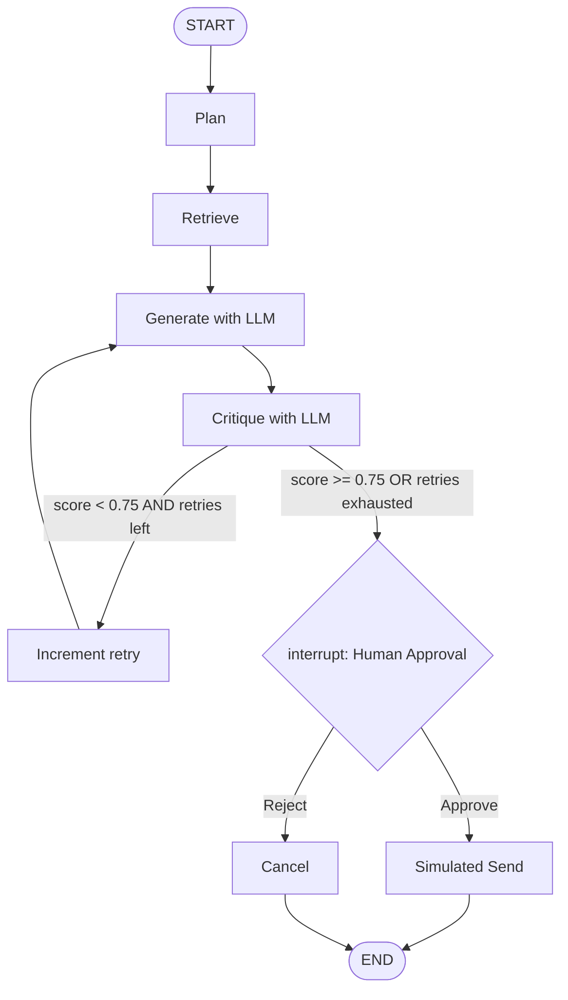

# Task 1 — Graph Concepts & State Design

## LangGraph's core building blocks

**`StateGraph`** — the graph *builder*. You construct it with a state
*schema* (a `TypedDict` or Pydantic model describing every field the
workflow can read or write), then register nodes and edges on it before
calling `.compile()` to get a runnable graph. It's the LangGraph analogue of
`AgentExecutor`, except you define the control flow explicitly instead of it
being implicit inside a fixed reason/act/observe loop.

**Nodes** — plain Python functions (or Runnables) registered with
`graph.add_node(name, fn)`. Each node takes the *current* state and returns a
**partial update** — a dict containing only the keys it changed. LangGraph
merges that partial update into the shared state before handing it to the
next node. A node is the graph's unit of work: one plan step, one tool call,
one LLM generation, one critique. Unlike `AgentExecutor`'s single
reason/act/observe loop, each node can contain arbitrary logic — an LLM call,
a tool call, plain Python, or nothing at all.

**Edges** — `graph.add_edge(a, b)`: a fixed, unconditional transition. After
node `a` finishes, node `b` always runs next. This is how a linear pipeline
like `plan → retrieve → generate` is expressed.

**Conditional edges** — `graph.add_conditional_edges(a, router_fn, {label:
node})`: after node `a` finishes, `router_fn(state)` inspects the *current*
state and returns a string key, which is looked up in the `{label: node}` map
to pick the next node. This is what makes branching — and, critically,
**cycles** — possible: nothing stops the target of a conditional edge from
being a node the graph has already visited (`critique → retry → generate →
critique → ...`). Plain `AgentExecutor` has no equivalent primitive; its loop
only knows how to call a tool and return to the model, not "re-run one
specific earlier step because a business rule I just evaluated says so."

**The shared `State` object** — a single typed object that every node reads
from and writes to. It's the graph's memory: instead of each node returning a
value that the *caller* has to thread into the next call by hand, every node
gets the entire running state and only reports what it changed. This is what
makes checkpointing, pause/resume, and time-travel debugging possible later —
the checkpointer is just persisting snapshots of this one object after every
node.

**`START` / `END`** — sentinel nodes marking where a run begins and where
it's allowed to terminate.

**Checkpointer** — a pluggable persistence layer (e.g. `InMemorySaver` /
`MemorySaver`) that snapshots the full state after every node, keyed by a
`thread_id`. This is what makes pausing (`interrupt()` /
`interrupt_before`/`interrupt_after`), resuming, and time-travel debugging
possible — state doesn't live only in a Python variable in your process; it
lives in the checkpointer.

---

## Chosen workflow: shopping-recommendation agent

A research/recommendation assistant that looks up product data, drafts a
recommendation, critiques and revises its own draft, then pauses for human
approval before "sending" anything to a client — sending a quote is the
risky, hard-to-undo action.

## State schema

```python
from typing import TypedDict, Literal

class AgentState(TypedDict, total=False):
    request: str                 # the client's request, e.g. "compare X and Y"
    plan: str                    # written by plan_node
    product_data: list[dict]     # retrieved via tools
    price_delta: float | None    # computed via a calculator tool
    draft: str                   # the recommendation text
    critique: str                # feedback from the critique step
    quality_score: float         # 0.0-1.0, from the critique step
    retry_count: int             # how many revision passes have run
    max_retries: int             # hard cap to prevent infinite cycles
    approved: bool | None        # human decision from the interrupt
    action_log: list[str]        # audit trail across every node
    status: str                  # human-readable current stage
```

`total=False` is used because most fields don't exist yet at `START` — e.g.
`draft` doesn't exist until after `generate` runs, so nodes only need to
supply the keys they actually produce.

---

## Graph drawn before writing any code

```text
                 ┌───────┐     ┌──────────┐     ┌──────────┐     ┌───────────┐
   START ──────▶ │ plan  │────▶│ retrieve │────▶│ generate │────▶│ critique  │
                 └───────┘     └──────────┘     └──────────┘     └─────┬─────┘
                                                       ▲                │
                                                       │      score<0.75 AND retries left
                                                       │                ▼
                                                  ┌────┴────┐     ┌──────────┐
                                                  │  retry  │◀────│  (loop)  │
                                                  └─────────┘     └──────────┘
                                                                        │
                                                          score>=0.75 OR retries exhausted
                                                                        ▼
                                                                  ┌───────────┐
                                                                  │ approval  │  <- interrupt()
                                                                  │ (human)   │     pauses here
                                                                  └─────┬─────┘
                                                         approve ◀──────┴──────▶ reject
                                                              ▼                      ▼
                                                     ┌────────────────┐     ┌────────────┐
                                                     │  send_report   │     │  rejected  │
                                                     └───────┬────────┘     └─────┬──────┘
                                                              ▼                    ▼
                                                                     END
```


